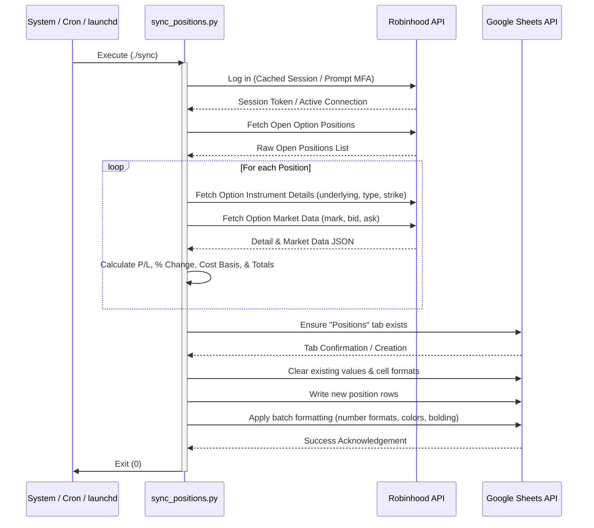

# Project Context: Options Position Tracker (Robinhood → Google Sheets Sync)

This document serves as the complete technical context for the **Options Position Tracker** project. It provides all architectural details, file structures, calculations, configurations, automation flows, and troubleshooting notes necessary for any AI model or developer to understand, maintain, or extend this project.

---

## 1. Overview & Core Objectives

The **Options Position Tracker** is a Python-based utility that automates the synchronization of active options positions from a **Robinhood** account into a designated **Google Sheet** (specifically targeting the `Positions` tab). 

### Key Objectives:
- **Accuracy**: Fetch live, accurate option positions (underlying ticker, strike price, expiration date, option type, quantities, average cost, and current market price).
- **Dynamic Valuation**: Calculate real-time Profit/Loss (P/L) and percentage change based on market mark/bid/ask prices.
- **Support for Long and Short Positions**: Correctly identify and evaluate both purchased options (long) and written options (short).
- **Beautiful Spreadsheet Mirroring**: Clear existing data and format the `Positions` tab with clean styling, custom color-coded number formatting (green for profit, red for loss), italicized sync timestamps, and bold headers/totals.
- **Automated Scheduling**: Run seamlessly every weekday morning (6:00 AM Pacific Time) to capture market status, waking up macOS systems automatically if asleep, or running autonomously in the cloud.

---

## 2. System Architecture & Sync Sequence

The script operates in a single, synchronous pipeline designed to execute efficiently, avoiding API rate-limiting issues.



---

## 3. File Structure & Directory Layout

Below is the layout of the project root directory (`/Users/tanishshah/options_updater/`):

*   **`sync_positions.py`** (Main Python Script): Contains the core logic. It reads credentials from `.env`, logs into Robinhood, fetches portfolio details, computes P/L metrics, establishes connection to the Google Sheets API via service account credentials, and formats/updates the sheet.
*   **`sync`** (Shell Wrapper Script): A convenience bash script to easily execute the sync from any directory. Activates the Python virtual environment (`.venv`) and runs the main script.
*   **`requirements.txt`**: Declares the project's Python dependencies:
    *   `robin_stocks>=3.1` (Robinhood API wrapper)
    *   `google-api-python-client>=2.100` (Google Sheets integration)
    *   `google-auth>=2.23` (Google authentication helper)
    *   `python-dotenv>=1.0` (Environment variable management)
*   **`deploy_to_cloud.sh`** (NEW - Cloud Deployment Orchestrator): Runs locally on your Mac. It packages your secrets, securely transfers your cached local Robinhood 2FA session token to the cloud VM, clones the repository, runs remote installations, rewrites environment paths dynamically, and programmatically schedules the remote cron job.
*   **`package_secrets.sh`** (NEW - Local Secrets Packager): Runs locally on your Mac to bundle `.env` and `service-account.json` into a secure `secrets.tar.gz` archive for easy manual or automated transfer.
*   **`setup_cloud.sh`** (NEW - Remote VM Installer): Deployed to the remote cloud server. It installs system utilities, compiles virtual environments, checks environment secrets, and provides automated setup guidelines.
*   **`.env`** (Ignored): The active local environment file containing sensitive access tokens, passwords, and sheet IDs.
*   **`.env.example`**: Template environment file with instructions on how to set up credentials.
*   **`service-account.json`** (Ignored): Google service account private key file in JSON format, granting editor access to the Google Sheet.
*   **`com.options-sync.plist.example`**: A template macOS `LaunchAgent` configuration to handle automatic weekday scheduling.
*   **`launchd.log`**: Local output log file where all automation stdout/stderr outputs are piped.
*   **`README.md`**: User-facing setup guide.
*   **`.venv/`** (Ignored): Python virtual environment directory containing local package binaries.

---

## 4. Data Processing & Calculations

### 4.1 Long vs. Short Positions Calculation
The script accurately accounts for option contract directions:
*   **Long Option (Buy to Open)**:
    *   Quantity is represented as a **positive** number.
    *   $\text{Profit/Loss} = (\text{Current Option Price} - \text{Average Buying Price}) \times \text{Quantity} \times 100$
    *   $\text{Cost Basis} = \text{Average Buying Price} \times \text{Quantity} \times 100$
*   **Short Option (Sell to Open / Writing)**:
    *   Quantity is represented as a **negative** number.
    *   $\text{Profit/Loss} = (\text{Average Buying Price} - \text{Current Option Price}) \times |\text{Quantity}| \times 100$
    *   $\text{Cost Basis} = \text{Average Buying Price} \times |\text{Quantity}| \times 100$

### 4.2 Current Option Price Evaluation
To ensure a robust "current market price", the script uses a fallback method inside `fetch_market_price()`:
1.  Attempt to fetch the `mark_price` from market data.
2.  If missing, attempt `adjusted_mark_price` or `last_trade_price`.
3.  If all are missing or evaluate to 0, use the midpoint: $\text{Current Price} = \frac{\text{bid\_price} + \text{ask\_price}}{2}$.
4.  Option prices from Robinhood are per-share (e.g. $1.50). The script multiplies by 100 to calculate the per-contract value.

### 4.3a Allocation (Column J)
Each row's **Allocation** = its initial invested amount ÷ **total portfolio initial capital** (fetched dynamically from `Summary!B1`, defaulting to `$45,000`). Options contribute `avg_price × contracts × 100` (computed as `abs(avg_price) × abs(quantity)`); stocks contribute `avg_cost × shares`. Per-position allocations represent their share of the initial portfolio capital; the **TOTAL** and **STOCK TOTAL** rows show each section's combined share of the initial capital. Scope is options + stocks pooled together.

### 4.3 Total Portfolio Summary
*   **Positions Sorting Order**: Options positions are listed in a strict, deterministic sequence: first sorted by expiration date (ascending), and then sorted alphabetically by the underlying ticker symbol (ascending) if multiple contracts share the same expiration date.
*   A blank spacer row is added at the end of individual options rows, followed by a **TOTAL** row.
*   The total P/L is the sum of all individual option P/Ls.
*   The total percentage change is calculated as:
    $$\text{Total \% Change} = \frac{\text{Total P/L}}{\text{Total Cost Basis}}$$

---

## 5. Google Sheets Layout & Styling Specifications

The script wipes the `Positions` tab clean on every run to eliminate trailing stale rows, then rebuilds it with strict formatting:

### 5.1 Spreadsheet Columns
The sheet contains 10 columns, structured as follows:

| Column | Header | Data Type | Notes / Format |
|---|---|---|---|
| **A** | Ticker | Text | Underlying symbol (e.g., `BBAI`) |
| **B** | Strike | Number | Strike Price (e.g., `4`) |
| **C** | Expiry | Date | Format: `YYYY-MM-DD` |
| **D** | Put/Call | Text | `P` for Put, `C` for Call |
| **E** | Avg Buying Price | Currency | Cost per contract (Format: `#,##0.00`) |
| **F** | No of Cons | Integer | Negative for Shorts, Positive for Longs |
| **G** | Current Price | Currency | Live market mark price per contract (Format: `#,##0.00`) |
| **H** | Profit/Loss | Signed Currency | P/L per position (Format: `+$#,##0.00` in Green / `-$#,##0.00` in Red) |
| **I** | % Change | Signed Percentage | Percentage gain/loss (Format: `+0.00%` in Green / `-0.00%` in Red) |
| **J** | Allocation | Percentage | Position's current market value ÷ total portfolio value (Format: `0.0%`) |

### 5.2 Specific Format Patterns
*   **Double Decimal Format (`NUMBER_2DEC_FMT`)**: `#,##0.00` (Applied to Avg Buying Price and Current Price).
*   **Signed Currency Format (`SIGNED_CURRENCY_FMT`)**: `[Color10]"+$"#,##0.00;[Red]"-$"#,##0.00;"$"0.00` (P/L column and Total P/L cell).
*   **Signed Percentage Format (`SIGNED_PCT_FMT`)**: `[Color10]"+"0.00%;[Red]"-"0.00%;0.00%` (% Change column and Total % cell).
*   *Note: `[Color10]` corresponds to Google Sheets' native dark forest green, which is much more readable than standard neon green.*

### 5.3 Text Styling & Typography
*   **Row 1**: Displays `Last synced: May 28, 2026 6:05 AM PDT`. Italicized, medium grey, left-aligned.
*   **Row 2**: Table headers. Bolded, centered, light blue-grey fill (`rgb 0.85,0.89,0.95`).
*   **Total / STOCK TOTAL rows**: Bolded.
*   **Centering**: Every cell from the header row down (cols A–J) is horizontally centered + vertically middle-aligned via a `repeatCell` over the whole table region.
*   **Borders**: A solid grey grid (`updateBorders`, all inner + outer) is drawn around each block — the options header+body, the options TOTAL row, and (if present) the STOCKS header+body and STOCK TOTAL row. Blank spacer rows are left unbordered as visual separators.
*   **Reset behaviour**: The per-run whole-sheet `updateCells` reset (fields `userEnteredFormat,userEnteredValue`) clears all prior fills/borders/alignment before re-applying, so formatting never accumulates or goes stale.
*   Helpers: `_align_center_req`, `_header_fill_req`, `_border_grid_req`, `_range` (all take a `sheetId` + row range).

### 5.4 Cash Metrics Layout (Positions Tab)
In addition to option and stock positions, the sync script writes live account cash metrics directly to the **Positions** tab in columns K & L (adjacent to the top rows of the main options table):
*   **Target Tab**: `Positions`
*   **Target Rows & Cells**:
    - **K2 / L2 (Cash in hand)**: Represents the total overall cash holdings in the account (`portfolio_cash`), which is settled cash + unsettled funds.
    - **K3 / L3 (Buying Power)**: Represents the available buying power (`buying_power`).
    - **K4 / L4 (Options Collateral)**: Represents cash held for options collateral (`cash_held_for_options_collateral`).
*   **Styling & Formatting**:
    - Column K contains the bolded, centered labels.
    - Column L contains the bolded, centered values, formatted dynamically as currency with zero decimal places (`"$"#,##0`).
    - A solid grey grid border is drawn around the K2:L4 cell region to match the table borders.
*   **Summary Tab Sync**: To keep the hand-curated `Summary` tab clean, the script automatically clears cells `Summary!G2:H4` on each run.

### 5.5 STOCKS Section (Open Share Positions)
Below the options table and its TOTAL row, the script appends a **STOCKS** section listing open share positions (e.g. FLNC ×400), pulled via `fetch_stock_positions()` (`r.account.get_open_stock_positions`, with one batched `get_latest_price` call for all tickers).
*   Layout reuses the same 9 columns: `A`=Ticker, `E`=Avg Cost (per share), `F`=Shares, `G`=Current Price (per share), `H`=Profit/Loss, `I`=% Change. Columns B–D are blank for stocks.
*   P/L per stock = `(current - avg_cost) × shares`; a bold **STOCK TOTAL** row sums it.
*   `build_sheet(positions, stocks)` returns `(rows, meta)`; `meta` carries the row ranges (`opt_body`, `opt_total`, `stock_body`, `stock_total`, `bold_rows`) so `main()` applies number formats/bolding generically to both blocks.
*   Bhuvan account only (same multi-account limitation as options).

### 5.6 Closed Positions Tab — Intentionally Manual
The `Closed Positions` tab (Ticker | Realized Profit/Loss, one row per closed trade) is **hand-maintained and never touched by the script** (user decision, 2026-06-01). Rationale: Robinhood does not store realized P/L on closed positions (`average_price` resets to 0 once closed), so it would have to be reconstructed from order history — which **misses expirations** (selling puts that expire worthless generates no closing order, only an event) and **cannot cover the individual sub-account** (not API-accessible without its account number). Some rows in the tab are from that individual account. **Do not automate this tab** unless the user explicitly revisits the decision.

### 5.7 Summary Tab — Formatting & Allocation Mirror
The Summary tab shows the same positions table as Positions via an **array formula** (`Summary!A8 = ={Positions!A3:J}`), which copies **values but not formatting**. So each run `main()`:
1. Clears the Summary table region's formatting (rows 7+, cols A–J; `updateCells` with `fields=userEnteredFormat` only — leaves the mirror formula/values intact), then
2. `copyPaste` PASTE_FORMAT from the freshly-formatted Positions block onto the aligned Summary region. **Offset is +5 rows**: Positions header (row index 1) → Summary header (row index 6 / sheet row 7); the spill at Summary A8 maps to Positions A3.

This keeps Summary visually identical to Positions — borders, header fills, centering, number formats, and the allocation column. A **one-time setup** (2026-06-02) extended the mirror formula from `A3:I` to `A3:J` and wrote the `Allocation` header to `Summary!J7` so column J flows through. If the user relocates the Summary table, this `+5` offset assumption breaks.

---

## 6. Automation & Scheduling Lifecycle

The system supports two independent scheduling methodologies:

### 6.1 macOS LaunchAgent (Local Client Scheduling)
*   **Daemon Configuration**: Managed via `~/Library/LaunchAgents/com.options-sync.plist`.
*   **Trigger Schedule**: Runs every Monday through Friday at exactly 6:00 AM PT.
*   **System Waking**: Utilizing `sudo pmset repeat wakeorpoweron MTWRF 05:55:00` allows the computer to wake up from sleep 5 minutes prior to execution, ensuring reliability when plugged into a power source.

### 6.2 Cloud Cron Schedule (Autonomous Server Scheduling - Recommended)
*   **Daemon Configuration**: Managed via the user `crontab` on a persistent Virtual Private Server (VPS) such as Google Cloud Compute Engine or AWS EC2.
*   **Timezone**: The VM clock is set to `America/Los_Angeles` (`sudo timedatectl set-timezone America/Los_Angeles`), so cron tracks **PT year-round** through DST transitions. Do **not** hardcode a UTC offset in the cron expression — that drifts by an hour between PST and PDT.
*   **Trigger Schedule**: Executes Mon-Fri at **6:00 AM and 12:00 PM PT** (pre-market refresh + midday refresh).
*   **Cron Entry**:
    ```cron
    0 6,12 * * 1-5 cd /home/tanishshah/options-updater && ./sync >> launchd.log 2>&1
    ```
*   **Benefit**: 100% reliable background execution without depending on local hardware power states, sleep settings, or home Wi-Fi networks.

### 6.3 On-Demand Trigger via Telegram Bot (Any Device)
*   **Component**: `telegram_bot.py` — a stdlib-only long-polling bot that runs as a systemd service (`options-sync-bot.service`) on the GCP VM, alongside the cron schedule.
*   **Purpose**: Trigger a sync on demand from any device (phone, laptop, web Telegram) without SSH or open firewall ports. The bot polls Telegram outbound, so no inbound port needs to be exposed.
*   **Commands**: `/sync` runs `./sync` and replies with a short result summary; `/id` reports the sender's chat ID (works without auth, for lockdown setup); `/start` / `/help` show usage.
*   **Security**: Locked to a single chat via `TELEGRAM_ALLOWED_CHAT_ID` in `.env`. Any other chat is refused. If that var is unset the bot refuses all `/sync` requests (fails closed). `TELEGRAM_BOT_TOKEN` and the chat ID live only in the gitignored `.env`.
*   **Service management**: `sudo systemctl {status,restart,stop} options-sync-bot`; live logs via `journalctl -u options-sync-bot -f`. Auto-restarts on crash and on VM reboot.

---

## 7. Known Failure Modes & AI Troubleshooting

This section details critical technical failure states identified in real-world sync history. **Any AI troubleshooting this application should cross-reference these issues first.**

### 7.1 DNS/Network Failure on Wake-up (`TransportError`)
> [!WARNING]
> **Issue**: In `launchd.log`, the sync sequence sometimes terminates with:
> `google.auth.exceptions.TransportError: Unable to find the server at oauth2.googleapis.com`
> or `socket.gaierror: [Errno 8] nodename nor servname provided, or not known`.
>
> **Root Cause**: When a Mac system wakes up via `pmset` at 5:55 AM, the computer wakes up instantly but the Wi-Fi card often takes 15 to 45 seconds to reconnect to the local network and re-establish DNS servers. The LaunchAgent runs at exactly 6:00:00 AM, and if the network interface is still negotiating, the API request immediately fails.
>
> **Solution**: Implement a pre-check loop at the start of `sync_positions.py` or the `sync` shell script that pings Google DNS (`8.8.8.8`) or attempts a lightweight connection. If it fails, wait 5 seconds and retry, up to a maximum of 60 seconds, before giving up.

### 7.2 macOS TCC Permissions (`Operation not permitted`)
> [!CAUTION]
> **Issue**: Running the script via launchd logs a permissions error, or throws `Operation not permitted`.
>
> **Root Cause**: macOS Transparency, Consent, and Control (TCC) restricts background daemons from accessing user directories (such as `~/Desktop/`, `~/Documents/`, and `~/Downloads/`) unless the terminal app or daemon is granted Full Disk Access.
> 
> **Solution**: Relocate the project folder outside restricted user subfolders (keep it directly in the user root `~/options_updater/`).

### 7.3 Multi-Account Ambiguity
> [!IMPORTANT]
> **Issue**: The sync executes without errors, but the Google Sheet displays an incorrect list of options (missing some contracts or displaying wrong accounts).
>
> **Root Cause**: The user's Robinhood login is associated with multiple sub-accounts (e.g. Joint, Custodial, IRA, Individual). If `ROBINHOOD_ACCOUNT_NUMBER` is not explicitly set, `robin_stocks` defaults to the first arbitrary sub-account it fetches.
> 
> **Solution**: Look up the specific account number via the mobile app (Profile -> Menu -> Account No.) and populate `ROBINHOOD_ACCOUNT_NUMBER` in the `.env` file.

### 7.4 Stale Spreadsheet Cell Formats
> [!NOTE]
> **Issue**: After modifying columns, headers, or changing position metrics, columns show unexpected formats (like strikes showing up as dates like `1900-01-03`).
>
> **Root Cause**: Writing a value in Google Sheets does not overwrite the preexisting cell number format. If a cell was formatted as a Date, writing a floating-point number into it will display as a date.
>
> **Solution**: The script resolves this by calling a batch `updateCells` API request, passing an empty `userEnteredFormat` mask across the entire sheet coordinates before writing values. This resets styling completely on every single run.

### 7.5 Remote Credentials Path Misalignment (`FileNotFoundError`)
> [!IMPORTANT]
> **Issue**: Running the sync on the remote cloud VPS throws a file-not-found error locating `service-account.json`.
>
> **Root Cause**: Copying the `.env` file directly from a Mac to the remote VM causes the remote server to inherit the Mac's hardcoded absolute path:  
> `GOOGLE_APPLICATION_CREDENTIALS=/Users/tanishshah/options_updater/service-account.json`  
> which does not exist on the Linux VM.
>
> **Solution**: During automated cloud deployment, a `sed` search-and-replace command runs on the remote VM, dynamically substituting the Mac home path with the VM's absolute path:  
> `GOOGLE_APPLICATION_CREDENTIALS=/home/tanishshah/options-updater/service-account.json`

### 7.6 Remote Package Manager Lock holding (`Could not get lock`)
> [!WARNING]
> **Issue**: Executing system setup or installs on the remote VM crashes with:  
> `E: Could not get lock /var/lib/apt/lists/lock. It is held by process XXXX (apt-get)`
>
> **Root Cause**: GCP VMs frequently execute background daily updates or unattended-upgrades immediately upon boot or connection, locking the package manager.
>
> **Solution**: Set the lock-waiting configuration `-o DPkg::Lock::Timeout=180` on all `apt-get` system commands. This instructs the package installer to wait up to 3 minutes for background locks to release before raising an exception.

### 7.7 Expired Contracts Lingering on the Sheet (Expiration Day)
> [!IMPORTANT]
> **Issue**: On an options expiration date (every Friday, plus some intra-week dates), positions that expired *today* keep showing as open on the sheet after a sync, even though they're effectively closed.
>
> **Root Cause**: `get_open_option_positions` still returns expired contracts with their **full `quantity`** until Robinhood settles the expiration overnight. They are flagged by `pending_expiration_quantity` being equal to the quantity. A naive `if quantity == 0: continue` filter never skips them.
>
> **Solution**: In `fetch_positions()`, compute the effective quantity as `quantity - pending_expiration_quantity` before the zero-check, so fully-expiring positions drop off immediately and partially-expiring ones show their remaining size. (Implemented 2026-05-29.)

---

## 8. High-Impact Future Improvements

For developers or AI agents planning to extend this codebase, here are the most valuable modifications to perform next:

1.  **Add Connectivity Wait-Loop (Priority: High)**:
    Add a robust network check loop prior to initiating Robinhood or Sheets calls.
    ```python
    import urllib.request
    import time

    def wait_for_network(url="https://oauth2.googleapis.com", timeout=60):
        start = time.time()
        while time.time() - start < timeout:
            try:
                urllib.request.urlopen(url, timeout=3)
                log.info("Network connected successfully.")
                return True
            except Exception:
                log.warning("Waiting for network connection...")
                time.sleep(5)
        log.error("Network connection timed out.")
        return False
    ```
2.  **Parallel Market Data Fetching (Priority: Medium)**:
    Currently, market data is fetched sequentially inside a `for` loop. Fetching market data in parallel using `concurrent.futures` can decrease runtime significantly for portfolios with larger amounts of options.
3.  **Sheet Backup / Archiving (Priority: Low)**:
    Before rewriting the live `Positions` tab, append the current day's totals to a separate `History` tab, generating an automated ledger of historical portfolio valuations.

---

## 9. Cloud Migration & Automation Orchestration

To run the system 100% autonomously, we migrated the tracker to a persistent Google Cloud Platform (GCP) Compute Engine `e2-micro` instance. This environment operates under a highly optimized deployment architecture:

```
+--------------------------------------------------------------+
|                     LOCAL MAC WORKSPACE                      |
|  - Compiles secrets (.env, service-account.json)             |
|  - Packs setup_cloud.sh into secrets.tar.gz archive          |
+------------------------------+-------------------------------+
                               |
                               |  gcloud compute scp (Uploads secrets)
                               v
+--------------------------------------------------------------+
|                      REMOTE VM INSTANCE                      |
|  - /home/tanishshah/.tokens/robinhood.pickle (Cached Token)  |
|  - /home/tanishshah/options-updater/         (Repository)    |
+------------------------------+-------------------------------+
                               |
                               |  gcloud compute ssh (Orchestrates deploy)
                               v
+--------------------------------------------------------------+
|                    AUTOMATED PROVISIONING                    |
|  - Installs Debian git packages with lock timeouts           |
|  - Clones clean Git repository to $HOME/options-updater      |
|  - Deploys secrets.tar.gz and extracts configuration         |
|  - Dynamically rewrites credentials path inside remote .env  |
|  - Installs virtual env (.venv) & caches Python wheels       |
|  - Runs test sync with Robinhood (bypassing 2FA via token)   |
|  - Programmatically registers Mon-Fri cron schedule          |
+--------------------------------------------------------------+
```

### 9.1 Session Caching & MFA Bypass Mechanics
Because Robinhood requires interactive 2FA/MFA on first-login, standard headless CI/CD systems cannot log in automatically. The orchestrator overcomes this by copying the Mac's locally generated session token `/Users/tanishshah/.tokens/robinhood.pickle` directly to `/home/tanishshah/.tokens/robinhood.pickle` on the VM. Subsequent remote cron jobs read this cached token, bypassing MFA completely and running in a fully automated, headless fashion.
